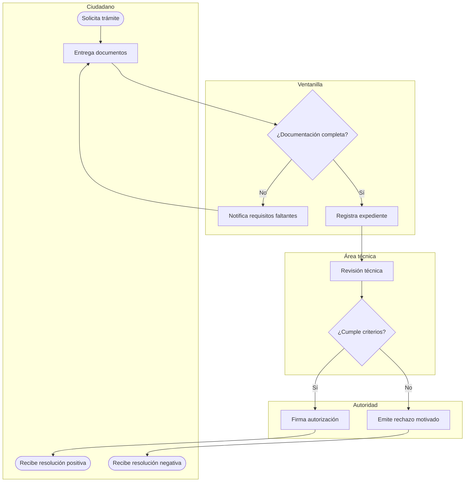

# Metodología de mapeo

## Por qué swimlanes y no un diagrama BPMN completo

BPMN formal (con toda su notación de eventos, compuertas, mensajes) es
preciso pero denso; la mayoría de los lectores de un documento de gobierno
(directores, funcionarios operativos, órganos de control) no están
entrenados en leerlo. Un diagrama de **carriles (swimlanes)** con símbolos
simplificados comunica el 90% de la información con una curva de lectura
casi nula, y es exactamente lo que Mermaid `flowchart` con subgrafos
puede producir bien. Reserva la precisión BPMN completa solo si el
usuario explícitamente la pide (p. ej. porque va a alimentar un motor de
BPM/workflow real).

## Convención de símbolos (Mermaid)

- **Carril por actor/dependencia**: un `subgraph` por cada área o rol
  distinto. El orden de los carriles de arriba a abajo debe reflejar
  jerarquía o secuencia lógica cuando sea posible (p. ej. Ciudadano
  arriba, luego Ventanilla, luego Área técnica, luego Autoridad que
  aprueba).
- **Paso de trabajo**: rectángulo `[Texto]`.
- **Punto de decisión**: rombo `{Texto}`, con las ramas etiquetadas
  (`-->|Sí|` / `-->|No|`, o `-->|Monto < $X|`).
- **Inicio/fin**: óvalo `([Texto])`.
- **Documento o expediente**: usa una nota textual entre paréntesis dentro
  del paso, o un nodo aparte con forma de documento si Mermaid lo soporta
  en el render objetivo; si no, indícalo como `[Genera: Oficio de
  respuesta]`.
- **Cuello de botella detectado**: márcalo con un comentario visual, por
  ejemplo agregando `:::bottleneck` a la clase del nodo y definiendo
  `classDef bottleneck fill:#f88` — o, si el render no soporta clases de
  forma confiable, simplemente anota el hallazgo en el texto que acompaña
  al diagrama en vez de forzarlo dentro del diagrama.
- **Espera/transferencia entre carriles**: una flecha que cruza de un
  subgraph a otro. Cada cruce de carril es, en la práctica, un punto
  donde algo puede estancarse — vale la pena que el texto que acompaña al
  diagrama diga explícitamente cuánto tiempo se pierde en cada cruce, si
  se conoce.

## Esqueleto de ejemplo

## Nivel de detalle correcto

Un error común es mapear a nivel "clic por clic" del sistema (demasiado
detalle, se vuelve ilegible y queda obsoleto rápido) o a nivel "y luego se
revisa" (demasiado vago, no sirve para diagnosticar). El nivel correcto
para la mayoría de entregables de diagnóstico es: **cada paso representa
una unidad de trabajo que un solo actor completa antes de pasar el
expediente/solicitud a alguien más, o una decisión que cambia la ruta.**
Si un paso tarda menos de un minuto y no involucra decisión ni cambio de
responsable, probablemente se puede fusionar con el paso anterior o
siguiente sin perder información útil para el diagnóstico.

## AS-IS antes que TO-BE

Mapea siempre primero cómo funciona el proceso realmente hoy — no como
dice el manual que debería funcionar, sino como el usuario describe que
ocurre en la práctica (esa diferencia entre manual y realidad suele ser
uno de los hallazgos más valiosos del diagnóstico). El TO-BE se dibuja
después, como una variación explícita del AS-IS, y debe ser fácil de
comparar contra él — mantén la misma convención de carriles siempre que
sea razonable para que el "antes/después" salte a la vista.

## Cuándo NO usar un diagrama

Si el proceso es lineal, sin bifurcaciones y con dos o tres actores, un
diagrama puede ser menos claro que una lista numerada de pasos con los
responsables entre paréntesis. Usa tu criterio: el diagrama gana su lugar
cuando hay decisiones, ciclos de retrabajo, o más de ~4 actores — si no,
prefiere texto simple y evita la sobre-ingeniería del entregable.
