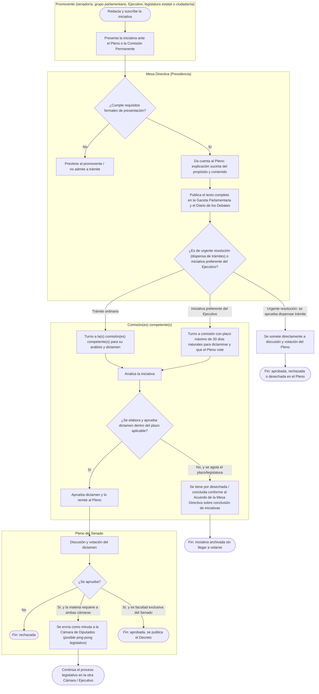

# Trámite de una iniciativa por la Mesa Directiva del Senado

> **Patrones aplicados** (ver `references/patrones-sector-publico.md` de la
> skill `sector-publico-workflows`): este proceso combina **Gestión de
> expedientes/trámites** (cada iniciativa se convierte en un expediente
> parlamentario con folio que se turna, dictamina y eventualmente se
> archiva) con **Validación normativa de documentos** (la Mesa Directiva
> revisa que la iniciativa cumpla los requisitos formales antes de
> admitirla a trámite) y, en menor medida, **Aprobación
> multinivel/jerárquica** (comisión dictamina → Pleno vota → posible
> "ping-pong" con la Cámara de Diputados si la reforma requiere a ambas
> cámaras).

## Nota sobre el tipo de AS-IS de este documento

A diferencia de un trámite ciudadano típico, aquí el AS-IS no se levantó
mediante entrevista a un operador del proceso, sino a partir del
**procedimiento normado** en el Reglamento del Senado y la Constitución
(ver fuentes al final). Esto significa que el diagrama refleja *cómo debe
operar el proceso según la norma*, no necesariamente *cómo se comporta en
la práctica* (negociaciones informales, tiempos reales de dictamen,
prácticas de la Mesa Directiva en turno). **Se recomienda validar este
AS-IS con alguien que opere el proceso desde dentro del Senado antes de
usarlo como base de una propuesta de mejora**, tal como pide la skill
para cualquier dato que no se pueda confirmar directamente.

---

## 1. Ficha del proceso

| Campo | Detalle |
|---|---|
| Dependencia(s) involucrada(s) | Mesa Directiva del Senado (Presidencia y Secretarías), Pleno del Senado, Comisión(es) ordinaria(s) o especial(es) competente(s), Gaceta Parlamentaria / Diario de los Debates |
| Disparador | Presentación de una iniciativa de ley o decreto ante el Pleno o la Comisión Permanente |
| Quién puede presentarla | Un senador o senadora, un grupo parlamentario, el Presidente de la República (incluidas iniciativas con carácter **preferente**, máximo dos por periodo ordinario), las legislaturas de los estados, o ciudadanos (**iniciativa ciudadana**, con verificación de firmas por el INE) |
| Base legal / normativa | Constitución Política de los Estados Unidos Mexicanos (proceso legislativo, iniciativa preferente), Reglamento del Senado de la República, Ley Orgánica del Congreso General |
| SLA (plazo normado) | Variable según el tipo de iniciativa — ver sección de hallazgos. Iniciativa preferente: máximo 30 días naturales para que el Pleno la discuta y vote. Iniciativa ciudadana: el INE tiene hasta 30 días naturales para verificar las firmas de respaldo. Iniciativa ordinaria de un senador: **sin plazo fijo de dictamen en el caso general** (ver Hallazgo 1). |
| Volumen aproximado | Alto — el Senado recibe cientos de iniciativas por legislatura; una fracción significativa nunca llega a dictamen (ver Hallazgo 1). Volumen exacto por periodo: pendiente de confirmar con Transparencia Parlamentaria del Senado. |
| Dueño del proceso | Presidencia de la Mesa Directiva da el trámite inicial (turno); la comisión a la que se turna es dueña del expediente durante el dictamen |

---

## 2. Diagrama AS-IS

**Puntos que el diagrama deja explícitos** (para evitar los huecos más
comunes al describir este proceso de memoria):

- La Mesa Directiva no dictamina — su función es **admitir a trámite y
  turnar**, no decidir el fondo. El fondo lo decide la comisión y,
  después, el Pleno.
- Existen al menos tres rutas distintas según el tipo de iniciativa
  (ordinaria, preferente del Ejecutivo, de urgente resolución), cada una
  con reglas de tiempo distintas — tratarlas como un solo flujo uniforme
  es un error común.
- El "fin sin resolución" (nodo `L`) es una salida real y frecuente del
  proceso, no una excepción rara — ver Hallazgo 1.

---

## 3. Hallazgos clave

1. **La ruta ordinaria (la más común) no tiene un plazo fijo de dictamen,
   y existe un mecanismo formal para dar por concluidas/archivadas las
   iniciativas que no se dictaminan a tiempo** (confirmado por la
   existencia de un "Acuerdo de la Mesa Directiva para dar conclusión a
   iniciativas" — ver fuentes). Esto es consistente con una crítica
   ampliamente documentada al proceso legislativo mexicano: una parte
   considerable de las iniciativas presentadas nunca llega a dictaminarse
   ni a votarse en el Pleno. **Impacto**: es el hallazgo de mayor
   relevancia si el objetivo es mejorar el proceso — no es un problema de
   "cuello de botella" en el sentido operativo tradicional, sino de
   ausencia de un mecanismo de seguimiento y rendición de cuentas sobre
   el destino de cada iniciativa turnada. **Pendiente de validar**: cifra
   exacta de iniciativas dictaminadas vs. archivadas por legislatura.
2. **El turno inicial (nodo `I`/`C`) concentra una decisión de criterio
   relevante** — a qué comisión(es) se turna una iniciativa puede
   determinar en buena medida su destino (algunas comisiones dictaminan
   más activamente que otras). No se confirmó si existen criterios
   objetivos publicados para esta asignación o si queda a criterio de la
   Presidencia de la Mesa Directiva caso por caso — patrón de
   "validación normativa" que advierte sobre el riesgo de inconsistencia
   cuando el criterio no es objetivo.
3. **Existen rutas de excepción (urgente resolución, preferente) que
   aceleran el proceso, pero dependen de una decisión política previa**
   (que el Pleno apruebe la dispensa de trámite, o que el Ejecutivo elija
   marcar la iniciativa como preferente) — no de una regla objetiva sobre
   el contenido o la urgencia real de la materia.
4. **La publicación en Gaceta Parlamentaria da transparencia al
   contenido de la iniciativa**, pero no necesariamente a su estatus
   posterior (si sigue en comisión, si fue desechada) de forma que un
   ciudadano o incluso otro senador pueda dar seguimiento fácil sin
   consultar activamente el sistema — pendiente de validar si el sistema
   de Transparencia Parlamentaria del Senado ya resuelve esto.

---

## 4. Recomendaciones

| # | Recomendación | Nivel | Hallazgo que atiende | Esfuerzo estimado |
|---|---|---|---|---|
| 1 | Documentar y publicar de forma clara y centralizada los criterios que sigue la Mesa Directiva para turnar una iniciativa a una u otra comisión | Nivel 1 — Documentar/estandarizar | Hallazgo 2 | Bajo |
| 2 | Generar y publicar periódicamente un tablero de seguimiento del estatus de cada iniciativa (en comisión / dictaminada / archivada por vencimiento), no solo su presentación inicial | Nivel 2/3 según si ya existe la base de datos (Transparencia Parlamentaria) — si ya existe, es solo exponerla mejor (Nivel 1-2); si no, requiere desarrollo (Nivel 3) | Hallazgos 1 y 4 | Depende de si el dato ya existe internamente |
| 3 | Evaluar (a nivel de política interna del Senado, no como recomendación técnica menor) si conviene establecer un plazo máximo razonable de dictamen para iniciativas ordinarias, con causales explícitas de prórroga, en vez de que el mecanismo de salida por defecto sea el archivo por vencimiento de legislatura | Nivel 2 — Rediseño normativo (requiere reforma al Reglamento, no es solo operativo) | Hallazgo 1 | Alto — decisión política, no solo técnica |

**Justificación del nivel priorizado**: el hallazgo de mayor impacto
(Hallazgo 1) no se resuelve con tecnología — es una decisión de diseño
normativo e institucional sobre si debe existir un plazo de dictamen. Por
eso la recomendación de más peso (3) es Nivel 2 pero de naturaleza
normativa/política, no un rediseño operativo simple como en un trámite
ciudadano. Las recomendaciones 1 y 2 son de menor esfuerzo y pueden
implementarse independientemente, aportando transparencia sobre el
proceso mientras se decide si se aborda el fondo del Hallazgo 1.

**Advertencia explícita**: ninguna de estas recomendaciones debe
interpretarse como una propuesta de automatizar la decisión de fondo
(turnar, dictaminar o votar una iniciativa) — esas son atribuciones
políticas y normativas que corresponden a la Mesa Directiva, las
comisiones y el Pleno. La automatización aquí, si acaso, se limita a
transparencia y seguimiento de estatus, igual que se advirtió en el caso
de la contraloría.

---

## 5. Riesgos y dependencias de implementación

- **Normativos**: cualquier cambio al mecanismo de conclusión de
  iniciativas o a los plazos de dictamen (recomendación 3) requiere
  modificar el Reglamento del Senado, lo cual es en sí mismo un proceso
  legislativo — no una implementación administrativa simple.
- **De sistemas**: depende de qué tan completa y pública ya esté la base
  de Transparencia Parlamentaria del Senado (`transparenciaparlamentaria.senado.gob.mx`)
  — si el dato de estatus por iniciativa ya existe ahí, la recomendación
  2 es de bajo esfuerzo (mejor exposición); si no, requiere desarrollo.
- **De capacidad institucional**: establecer plazos de dictamen o
  criterios objetivos de turno puede encontrar resistencia si hoy esa
  discrecionalidad es vista como una herramienta política legítima de la
  Mesa Directiva y las comisiones, no solo como una ineficiencia — esto
  debe abordarse con sensibilidad política, no solo como mejora de
  proceso.

---

## 6. Pendientes de validar

- Confirmar con el Reglamento vigente (texto oficial, no fuentes
  secundarias) el número exacto de artículo para cada regla citada aquí.
- Cifra real de iniciativas presentadas vs. dictaminadas vs. archivadas
  por legislatura, para dimensionar el Hallazgo 1 con evidencia.
- Si existen criterios publicados para el turno de iniciativas a
  comisión, o si es discrecional.
- Estado actual del sistema de Transparencia Parlamentaria respecto al
  seguimiento de estatus post-presentación.
- Validar este AS-IS con alguien que opere el proceso desde la Mesa
  Directiva o una comisión, dado que se construyó a partir de fuentes
  normativas y no de una entrevista directa.

---

## Fuentes consultadas

- [Reglamento del Senado de la República (Orden Jurídico Nacional)](https://www.ordenjuridico.gob.mx/Documentos/Federal/html/wo88698.html)
- [Reglamento del Senado de la República (PDF, Cámara de Diputados)](https://portalhcd.diputados.gob.mx/LeyesBiblio/pdf_mov/Reglamento_del_Senado.pdf)
- [Acuerdo de la Mesa Directiva para dar conclusión a iniciativas](https://infosen.senado.gob.mx/sgsp/gaceta/65/3/2024-04-30-1/assets/documentos/3-Acuerdo_MD_Conclusion_Iniciativas_Senadores.pdf)
- [El proceso legislativo — Biblioteca Digital IBD-Senado](http://bibliodigitalibd.senado.gob.mx/bitstream/handle/123456789/1810/PROCESO_LEGISLATIVO.pdf?sequence=1&isAllowed=y)
- [Transparencia Parlamentaria — Iniciativas y Decretos de Ley](https://transparenciaparlamentaria.senado.gob.mx/transparencia_parlamentaria/?c=iniciativas&a=data)
- [La iniciativa legislativa ciudadana en México. Estudio de casos](http://bibliodigitalibd.senado.gob.mx/bitstream/handle/123456789/4114/CI_47.pdf?sequence=1&isAllowed=y)
